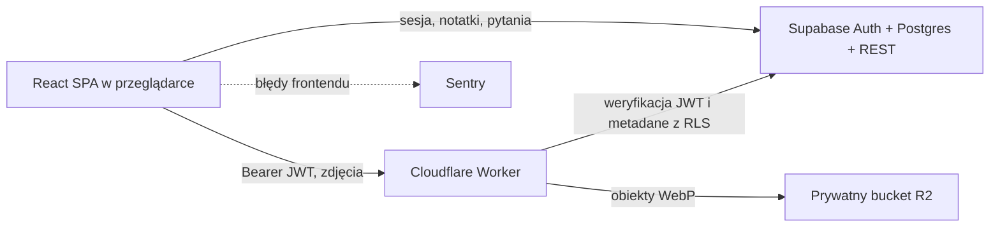

# Architektura

## Komponenty



Frontend jest statyczną aplikacją SPA hostowaną na Vercel. Supabase odpowiada
za logowanie i dane relacyjne. Zdjęcia nie przechodzą przez Vercel: frontend
wysyła je do Workera, który weryfikuje token Supabase i zapisuje plik w
prywatnym R2.

## Granice bezpieczeństwa

- Klient używa wyłącznie publishable key Supabase. `service_role` nie może
  znaleźć się w frontendzie ani Workerze.
- RLS ogranicza rekordy do `auth.uid() = user_id`.
- Worker przekazuje token użytkownika do Supabase REST, więc zapytania o
  metadane zdjęć nadal podlegają RLS.
- Bucket R2 jest prywatny. Odczyt, zapis i usuwanie pliku odbywa się przez
  Workera po uwierzytelnieniu.
- `ALLOWED_ORIGINS` jest dokładną listą originów, nie wzorcem `*`.
- Worker ogranicza tempo żądań, ale nie liczbę zdjęć użytkownika. Pojedynczy
  upload ma techniczny limit 10 MB i jest normalizowany do WebP po stronie
  klienta.

## Model danych

Najważniejsze relacje:

```text
auth.users
└── chapters
    └── topics
        ├── topic_images  -> obiekt w R2 wskazany przez storage_key
        └── questions
            └── question_options

auth.users
└── study_sessions
    └── study_session_items
```

Każda tabela aplikacyjna posiada `user_id`. Kolejność rozdziałów, tematów,
zdjęć i elementów sesji jest zapisywana w kolumnie `position`. Treść notatki
jest dokumentem JSON zgodnym z modelem TipTap.

## Warstwy frontendu

- `src/features/*/model` — typy i czysta logika domenowa;
- `src/features/*/data` — repozytoria Supabase oraz usługa zdjęć;
- `src/features/*/hooks` — stan i orkiestracja interfejsu;
- `src/features/*/components` — widoki i interakcje;
- `src/lib` — współdzielone integracje Supabase i Sentry.

Testy obejmują przede wszystkim czystą logikę. Integracje z Supabase, R2 i
przeglądarką wymagają osobnych testów integracyjnych lub smoke testów po
wdrożeniu.
