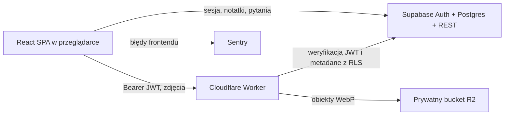

# Architektura

## Komponenty



Frontend jest statyczną aplikacją SPA hostowaną na Vercel. Supabase odpowiada
za logowanie i dane relacyjne. Zdjęcia nie przechodzą przez Vercel: frontend
wysyła je do Workera, który weryfikuje token Supabase i zapisuje plik w
prywatnym R2.

Frontend jest instalowalną aplikacją PWA. Service worker przechowuje wyłącznie
statyczny shell aplikacji: HTML, wersjonowane skrypty, style, fonty i ikony.
Żądania Supabase, Auth, Workera zdjęć, Turnstile oraz Sentry pozostają
network-only. Brak internetu nie uruchamia kolejki zapisów ani automatycznej
synchronizacji.

## Granice bezpieczeństwa

- Klient używa wyłącznie publishable key Supabase. `service_role` nie może
  znaleźć się w frontendzie ani Workerze.
- RLS ogranicza rekordy do `auth.uid() = user_id`.
- Worker przekazuje token użytkownika do Supabase REST, więc zapytania o
  metadane zdjęć nadal podlegają RLS.
- Bucket R2 jest prywatny. Odczyt, zapis i usuwanie pliku odbywa się przez
  Workera po uwierzytelnieniu.
- `ALLOWED_ORIGINS` jest dokładną listą originów, nie wzorcem `*`.
- Worker ogranicza tempo żądań, ale nie liczbę zdjęć użytkownika. Pojedynczy
  upload ma techniczny limit 10 MB i jest normalizowany do WebP po stronie
  klienta.

## Model danych

Najważniejsze relacje:

```text
auth.users
└── chapters
    └── topics
        ├── topic_images  -> obiekt w R2 wskazany przez storage_key
        └── questions
            └── question_options

auth.users
└── study_sessions
│   └── study_session_items
└── study_goals
```

Każda tabela aplikacyjna posiada `user_id`. Kolejność rozdziałów, tematów,
zdjęć i elementów sesji jest zapisywana w kolumnie `position`. Treść notatki
jest dokumentem JSON zgodnym z modelem TipTap.

Element sesji przechowuje snapshot rozdziału i tematu, dzięki czemu historyczne
statystyki pozostają poprawne po przeniesieniu lub usunięciu pytania. Nowe
odpowiedzi zapisują aktywny czas pracy; starsze sesje korzystają z ograniczonego
czasu pomiędzy rozpoczęciem i zakończeniem sesji. Agregaty statystyk są liczone
przez `get_study_statistics` po stronie Postgresa i respektują RLS wywołującego.

## Warstwy frontendu

- `src/features/*/model` — typy i czysta logika domenowa;
- `src/features/*/data` — repozytoria Supabase oraz usługa zdjęć;
- `src/features/*/hooks` — stan i orkiestracja interfejsu;
- `src/features/*/components` — widoki i interakcje;
- `src/lib` — współdzielone integracje Supabase i Sentry.

`pnpm test` obejmuje logikę, interakcje React w jsdom i obsługę awarii API
zdjęć z podstawionymi usługami zewnętrznymi. `pnpm test:db` odtwarza schemat
na pustym Postgresie i sprawdza RLS dla dwóch użytkowników. Logowanie przez
Supabase Auth i operacje na prawdziwym R2 wymagają smoke testów środowiska.

Treść notatki staje się zapisaną wersją dopiero po potwierdzeniu serwera.
Szkic dopisany podczas zapisu pozostaje niezapisany i blokuje opuszczenie
notatki. Wylogowanie z niezapisanymi zmianami wymaga ich jawnego odrzucenia.
Szkice są przechowywane w IndexedDB, z kluczem konta i modułu. Wracają po
odświeżeniu oraz ponownym uruchomieniu zainstalowanej aplikacji. Nie jest to
synchronizacja offline ani autosave na serwerze. Brak miejsca lub niedostępny
magazyn powoduje widoczny komunikat. Jawne odrzucenie usuwa szkic.
Szkic zachowuje oryginalną treść jako bazę zapisu. UPDATE porównuje ją atomowo
z treścią na serwerze; brak pasującego rekordu zatrzymuje zapis i zachowuje szkic.
Kolejność rozdziałów jest zapisywana pojedynczym RPC reorder_chapters.
Błąd odświeżenia podsumowania po zapisie nie cofa zatwierdzonej operacji w UI.
